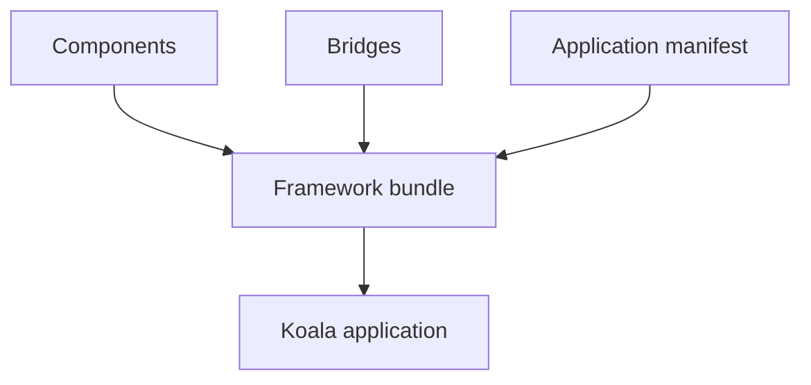
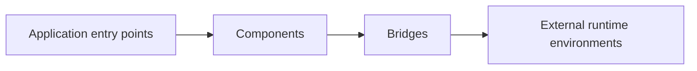

# KoalaTs Architecture

> [!NOTE]
> This document describes the architecture of KoalaTs starting from the `v3` which is a work in progress and a
> complete rewrite of the framework.

## Overview

KoalaTs is a monorepo made of three package types:

- "Component": A standalone reusable library. It solves one focused problem and can be used without KoalaTs.
- "Bridge": An integration layer between KoalaTs components and an external library or ecosystem.
- "Bundle": The application-level composition of components and bridges.

## Goals

KoalaTs is a modern, easy-to-use, functional-programming-first framework. It separates application behavior from
external runtime integrations.

## Architecture

### Framework Bundle

The framework bundle is the composition root of an application. It combines components and bridges with an application
manifest.

```typescript
koala(bridges)(manifest);
```

## Application composition



The bundle assembles an application from its manifest and the selected components and bridges.

## Application behavior

An application can expose multiple entry points, such as HTTP, console, or MCP. Each entry point is supported by a
component and connected to its runtime environment through a bridge.


